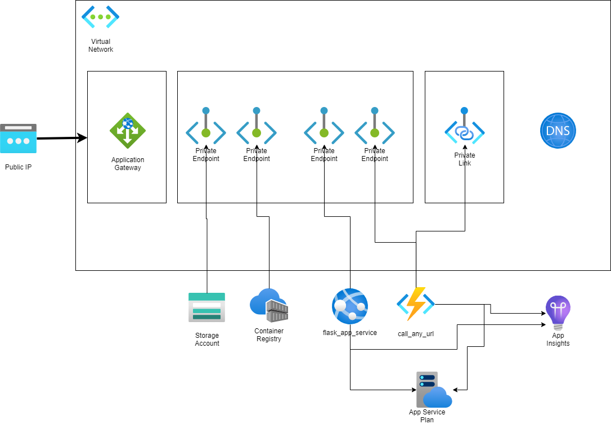
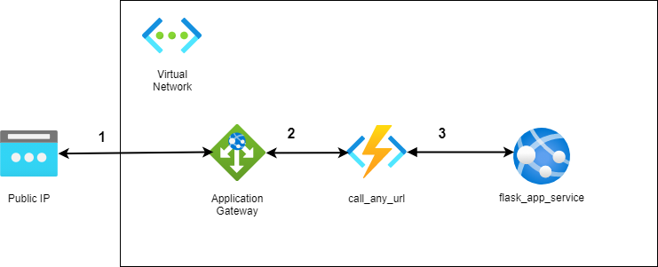

# Private Intra-VNet App Services communication secured by Private Endpoints and App Gateway using Terraform

[](https://github.com/dariuszparys/services-in-vnet/actions/workflows/validate-terraform.yml)

This sample demonstrates how to publish an Azure Function App and an Azure App Service
into a VNet and lock them down through an Azure Application Gateway, so the communication
between both services just happens in the VNet. The following diagram shows the various
components used in this demo



The request / response flow demonstrates the simplified flow of the components involved



1. Through a public endpoint a client queries the Azure Function App
2. The Application Gateway delegates the request to the backend pool which is pointing
to the private endpoint of the Azure Function App
3. The Azure Function App calls into the VNet through the private link to access
the private endpoint of the Azure App Service Web App

## Deploy the sample

In order to use the sample as it is we go with a two step approach. This is needed in order
to deploy the built docker container for the sample applications that will be build and pushed
to the newly created Azure Container Registry.

> This step can be omitted if there is another means of pushing the containers into the registry
like for instance having an Jumpbox living in the VNet

### Terraform Compliance Testing

In the directory `terraform/features` you'll find [Terraform Compliance](https://terraform-compliance.com)
tests which are executed against a terraform plan. In order to run those test you need to
install terraform compliance in your python environment

`pip install terraform-compliance`

### Terraform apply without VNet

Running the following commands

```bash
cd terraform/Provision-VNet-Infrastructure
terraform init
terraform plan -out=plan.tfplan
terraform apply plan.tfplan
```

will provision the following components

- Azure Container Registry
- Azure Application Insights
- Azure Service Plan with Premium P1v2 SKU
- Azure Function App
- Azure App Service App
- Azure Storage Account

### Terraform apply with VNet

Once it was deployed without VNet a second terraform plan with the proper
variable definition can be triggered in order to lock down the resources into
a VNet and make them only accessible through the Application Gateway Public 
endpoint.

To enable the VNet simply run

```bash
terraform plan -out=plan.tfplan -var='enable_vnet=true'
terraform apply plan.tfplan
```

and it will provision in addition the following components

- Azure Virtual Network
- Azure Application Gateway (Standard_V2)

> **Note** This deployment will take longer as Azure Application Gateway
needs time to spawn upRunning the following commands

#### Optional Testing Step for None VNet and VNet

If you want to execute the terraform compliance tests before applying the plan enter

`terraform-compliance -p plan.tfplan -f ../features/`

The test suite will run. Expect skipping tests for none VNet plan.

## Deployment artifacts

The deployment provisions two applications into the VNet. During the terraform run
those applications are build into containers and pushed to the Azure Container
Registry. Those container images are referenced by the corresponding services.

### call_any_url (Azure Function App)

The service has one function endpoint with the name `goto`. In order to call it you
have to provide an `url` parameter. The provided url will be used to request the
reponse of the endpoint.

### flask_app_service (Azure App Service Web App)

This services just return the current operating system running on via its root path

## Test the Application

To test the application you call the call_any_url function endpoints.

### Calling from a none VNet environment

Retrieve terraform output parameters with `terraform output` and you'll retrieve the
none VNet endpoint information

e.g.

```bash
app_service_endpoint = "xyz-dev-appservice-msl0.azurewebsites.net"
function_app_endpoint = "xyz-dev-functionapp-msl0.azurewebsites.net"
resource_group_created = "rg-with-vnet"
test_call = "https://xyz-dev-functionapp-msl0.azurewebsites.net/api/goto?url=https://xyz-dev-appservice-msl0.azurewebsites.net"
```

### Calling into a VNet environment

The only way to call now the Azure Function App is through the public ip address.

Unfortunatly you can't output optional resource blocks in terraform. Therefore just executed
the following Azure CLI command to retrieve the public ip for the application gateway

```bash
az network public-ip list --resource-group <CREATED RESOURCE GROUP> --query [].ipAddress --output tsv
```

You can now build up the endpoint like in the none VNet environment and replace the first
protocol with http and the function app with the public ip

e.g.

```bash
❯ curl http://20.76.141.227/api/goto?url=https://xyz-dev-appservice-msl0.azurewebsites.net
Hello, world. (running on 4.15.0-135-generic)
```

## References

This sample application is an excerpt of an bigger script to nail down the base of
having 
